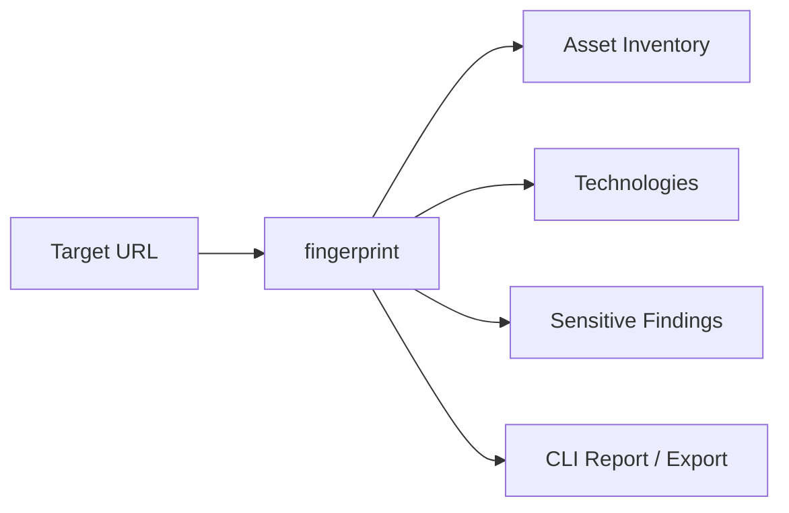

# TechSpecter

**Passive web application intelligence — discover technologies, assets, and sensitive exposure without touching the attack surface.**

[](https://github.com/Amirbarkhordari/TechSpecter/actions/workflows/ci.yml)
[](https://github.com/Amirbarkhordari/TechSpecter/actions/workflows/codeql.yml)
[](https://www.python.org/downloads/)
[](https://opensource.org/licenses/MIT)
[](https://github.com/Amirbarkhordari/TechSpecter/releases)

> **Release candidate:** v1.0.0-rc1 — stable v1.0.0 and PyPI publication coming soon. Until then, install from source or Git tags.

---

## Overview

**TechSpecter** is a passive web application intelligence platform. Point it at a URL and it collects publicly accessible HTML, JavaScript, assets, and metadata, then produces structured reports about technologies, versions, asset inventories, and sensitive exposure indicators.

It is built for security engineers, developers, and researchers who need **reconnaissance-grade insight** from the outside in — the same signals you might gather manually from DevTools, source maps, and response headers, but automated, attributed, and exportable.

> [!IMPORTANT]
> TechSpecter performs **passive analysis only**. It downloads and inspects publicly reachable resources. It does not probe for vulnerabilities, attempt exploitation, or interact with targets beyond normal HTTP retrieval.

| What you get | How |
|---|---|
| Technology stack | 65+ fingerprint signatures plus optional Wappalyzer and Retire.js providers |
| Asset inventory | JavaScript, CSS, JSON, fonts, images, workers, source maps, and more |
| Version intelligence | Evidence-backed version detection from bundles and metadata |
| Sensitive exposure | Secrets, credentials, config leaks, and developer artifacts in downloaded assets |
| Reports | Rich CLI output plus JSON, Markdown, HTML, CSV, and SARIF exports |

---

## Key Capabilities

### Technology detection

Identify frameworks, libraries, build tools, and UI kits from JavaScript bundles, HTML, and network evidence. Results include confidence scores and optional multi-provider merging.

### Asset discovery

Passively discover and inventory linked assets. Individual download failures are recorded without aborting the scan.

### Technology intelligence

Attribute detected technologies to specific assets with version evidence and pattern matches suitable for audit trails.

### Secret & sensitive intelligence

Scan downloaded text assets for API keys, tokens, credentials, internal endpoints, and developer artifacts. Findings include severity, confidence, source attribution, and remediation guidance.

### Reporting

Interactive terminal reports for day-to-day use, plus machine-readable exports for CI pipelines and security tooling.

---

## What TechSpecter Does Not Do

> [!WARNING]
> TechSpecter is **not** a vulnerability scanner or penetration testing tool.

| Excluded | Detail |
|---|---|
| Vulnerability scanning | No CVE exploitation or active probes |
| Exploitation | No payload delivery or attack execution |
| Brute force | No credential guessing |
| Authenticated testing | No login flows or session hijacking |
| Network enumeration | Scope is HTTP(S) resources linked from the target |

---

## Supported Operating Systems

| Platform | Support | Notes |
|---|---|---|
| **Windows** | Supported | Tested in CI on Windows runners |
| **Linux** | Supported | Tested in CI on Ubuntu |
| **macOS** | Supported | Expected to work; not in primary CI matrix |
| **Docker** | Supported | Run from a container image you build locally (see below) |

**Requirements:** Python 3.11, 3.12, or 3.13 · pip · network access to target URLs

---

## Installation

### Windows

Install [Python 3.11+](https://www.python.org/downloads/) and ensure **Add Python to PATH** is checked during setup.

```powershell
git clone https://github.com/Amirbarkhordari/TechSpecter.git
cd TechSpecter

python -m venv .venv
.venv\Scripts\activate

python -m pip install --upgrade pip
pip install .
```

Verify:

```powershell
techspecter --version
techspecter doctor
```

### Linux

```bash
# Debian / Ubuntu
sudo apt update && sudo apt install -y python3 python3-venv python3-pip git

git clone https://github.com/Amirbarkhordari/TechSpecter.git
cd TechSpecter

python3 -m venv .venv
source .venv/bin/activate

python -m pip install --upgrade pip
pip install .
```

Verify:

```bash
techspecter --version
techspecter doctor
```

### macOS

Install Python 3.11+ via [python.org](https://www.python.org/downloads/) or Homebrew:

```bash
brew install python@3.12 git
```

Then install TechSpecter:

```bash
git clone https://github.com/Amirbarkhordari/TechSpecter.git
cd TechSpecter

python3 -m venv .venv
source .venv/bin/activate

python -m pip install --upgrade pip
pip install .
```

Verify:

```bash
techspecter --version
techspecter doctor
```

### PyPI (when v1.0.0 stable is published)

```bash
python -m pip install --upgrade pip
pip install techspecter
```

### Virtual environments

A virtual environment isolates TechSpecter and its dependencies from your system Python.

| Step | Purpose |
|---|---|
| `python -m venv .venv` | Creates an isolated environment in `.venv/` |
| Activate (see platform commands above) | Uses the venv's Python and `pip` |
| `pip install .` | Installs TechSpecter into the venv |
| `deactivate` | Returns to the system Python |

> [!TIP]
> Activate the virtual environment in every new terminal session before running `techspecter`.

### Docker

There is no pre-published Docker Hub image yet. Build and run locally:

**1. Create a `Dockerfile` in the repository root:**

```dockerfile
FROM python:3.12-slim-bookworm

WORKDIR /opt/techspecter
COPY . .
RUN pip install --no-cache-dir .

ENTRYPOINT ["techspecter"]
```

**2. Build the image:**

```bash
git clone https://github.com/Amirbarkhordari/TechSpecter.git
cd TechSpecter
docker build -t techspecter:local .
```

**3. Run scans:**

```bash
# Full fingerprint
docker run --rm techspecter:local fingerprint https://example.com

# Export HTML report to the current directory
docker run --rm -v "${PWD}:/out" techspecter:local \
  fingerprint https://example.com --format html --output /out/report.html

# Use a configuration file
docker run --rm -v "${PWD}/techspecter.yaml:/config/techspecter.yaml" techspecter:local \
  fingerprint --config /config/techspecter.yaml https://example.com
```

On Windows PowerShell, use `$PWD` or an absolute path (for example, `D:\reports`) in place of `${PWD}`.

### Development installation

For contributors and plugin authors, install in **editable** mode with development tools:

```bash
git clone https://github.com/Amirbarkhordari/TechSpecter.git
cd TechSpecter

python -m venv .venv
source .venv/bin/activate   # Windows: .venv\Scripts\activate

pip install -e ".[dev]"
```

Editable mode (`-e`) links the installed package to your working tree — code changes take effect without reinstalling.

Run the test suite:

```bash
pytest
```

Optional extras:

```bash
pip install -e ".[release]"   # build and publish tooling
pip install -e ".[sbom]"      # SBOM generation
```

Full platform notes: [docs/INSTALLATION.md](docs/INSTALLATION.md)

---

## Quick Start

### Run a full scan (recommended)

The `fingerprint` command runs the complete passive pipeline in one pass:

```bash
techspecter fingerprint https://example.com
```

Output sections: Target Summary → Asset Inventory → Technology Detection → Technology Intelligence → Technology Evidence → Secret & Sensitive Intelligence → Security Summary.

### Common workflows

**Export an HTML report for sharing:**

```bash
techspecter fingerprint https://example.com --format html --output report.html
```

**Automate with JSON:**

```bash
techspecter fingerprint https://example.com --json > results.json
```

**Run focused analyzers:**

```bash
techspecter discover https://example.com              # JavaScript discovery only
techspecter analyze https://example.com               # HTTP headers, cookies, HTML
techspecter metadata https://example.com              # robots.txt, sitemap, well-known
techspecter artifacts https://example.com             # cloud, API, identity artifacts
techspecter sensitive-intelligence https://example.com
```

**Use a configuration file:**

```bash
techspecter --config examples/config/techspecter.yaml fingerprint https://example.com
```

**Inspect your environment:**

```bash
techspecter doctor
techspecter doctor --json
techspecter plugins list
```



More examples: [docs/QUICKSTART.md](docs/QUICKSTART.md)

---

## CLI Command Reference

| Command | Description |
|---|---|
| `techspecter fingerprint <url>` | Full passive scan — discovery, assets, technologies, sensitive intel, reporting |
| `techspecter discover <url>` | Discover and download JavaScript resources |
| `techspecter analyze <url>` | HTTP, header, cookie, and HTML analysis |
| `techspecter metadata <url>` | robots.txt, sitemap, security.txt, and HTML metadata |
| `techspecter artifacts <url>` | Cloud configs, API specs, and identity artifacts |
| `techspecter sensitive-intelligence <url>` | Secret and sensitive-data analysis |
| `techspecter sensitive <url>` | Legacy sensitive-data command |
| `techspecter benchmark <url>` | Compare detection against Wappalyzer |
| `techspecter doctor` | Installation and environment diagnostics |
| `techspecter plugins list` | List registered plugins |
| `techspecter plugins show <id>` | Show plugin details |
| `techspecter plugins validate` | Validate plugin manifests |
| `techspecter plugins doctor` | Plugin load diagnostics |

### Frequently used options

| Option | Applies to | Description |
|---|---|---|
| `--json` | Most commands | Machine-readable JSON output |
| `--format <fmt>` | `fingerprint`, `analyze` | Export format: `json`, `markdown`, `html`, `csv`, `sarif` |
| `--output <path>` | `fingerprint`, `analyze` | Write exported report to file |
| `--config <path>` | Global | Load YAML or JSON configuration |
| `--verbose` | `fingerprint` | Verbose output including full asset table |
| `--show-assets` | `fingerprint` | Display full asset inventory table |
| `--min-confidence <n>` | `fingerprint` | Filter detections below confidence threshold |
| `--provider <name>` | `fingerprint` | Enable provider: `techspecter`, `wappalyzer`, `retirejs`, `all` |
| `--debug` | Global | Enable debug logging |
| `--quiet` / `-q` | Global | Minimal console output |

Run `techspecter <command> --help` for the full option list.

---

## Configuration

TechSpecter merges settings from multiple layers:

```
Defaults → config file (YAML/JSON) → environment variables → CLI flags
```

**Config file:**

```bash
techspecter --config examples/config/techspecter.yaml fingerprint https://example.com
```

**Environment variables** use the `TECHSPECTER_` prefix with nested keys separated by `__`:

```bash
export TECHSPECTER_LOGGING__LEVEL=DEBUG
export TECHSPECTER_PERFORMANCE__PARALLEL_ANALYZERS=true
export TECHSPECTER_ANALYSIS__MIN_CONFIDENCE=50
```

**Common configuration sections:**

| Section | Controls |
|---|---|
| `crawler` | Discovery and redirect behavior |
| `downloader` | HTTP timeouts, retries, concurrency |
| `analysis` | Global analyzer enablement |
| `reporting` | Default export format and output paths |
| `logging` | Console/file logging and quiet mode |
| `performance` | Caching and parallel execution |
| `plugins` | Plugin directories and enable/disable lists |

Example snippet:

```yaml
logging:
  level: INFO
  quiet: false

downloader:
  request_timeout: 30.0
  max_retries: 3

reporting:
  default_format: html
  output_directory: ./reports
```

See [examples/config/techspecter.yaml](examples/config/techspecter.yaml) and [docs/CONFIGURATION.md](docs/CONFIGURATION.md).

---

## Sample Output

Fingerprint CLI output is concise by default. Below is a representative excerpt.

```
==================================================
Target Summary
==================================================

Target: https://example.com/
Elapsed: 8420 ms
Assets discovered: 74
Security findings: 3

==================================================
Asset Inventory
==================================================

Summary

JavaScript ............ 29
CSS ................... 9
JSON .................. 1
Manifest .............. 3
Fonts ................. 5
Images ............... 21

Total Assets .......... 74

Download Summary

Downloaded ............ 60
Failed ............... 14
Skipped ............... 0
Rate Limited .......... 0

==================================================
Technology Detection
==================================================

                Detected Technologies
+---------------------------------------------------+
| Technology | Category      | Version | Confidence |
|------------+---------------+---------+------------|
| React      | framework     | 19.2.8  | 97.0       |
| webpack    | build-tool    | Unknown | 94.0       |
+---------------------------------------------------+

==================================================
Secret & Sensitive Intelligence
==================================================

Secrets ..................... 0
Credentials ................. 0
Sensitive Configuration ..... 3
Developer Artifacts ......... 0

Sensitive Configuration
--------------------------------
  [medium] internal-ip (80%) — 10.0.0.12 — config.js

==================================================
Security Summary
==================================================

Sensitive Intelligence

Secret & Sensitive Findings ... 3
Medium ........................ 3
Sensitive Configuration ....... 3
```

Use `--show-assets` or `--verbose` to display the full asset inventory table.

---

## Documentation

| Guide | Description |
|---|---|
| [Quick Start](docs/QUICKSTART.md) | Get running in minutes |
| [Installation](docs/INSTALLATION.md) | Platform setup and troubleshooting |
| [Configuration](docs/CONFIGURATION.md) | YAML, JSON, and environment settings |
| [Developer Guide](docs/DEVELOPER.md) | Programmatic API and analyzer authoring |
| [Plugin SDK](docs/PLUGIN_SDK.md) | Build custom analyzers |
| [Roadmap](ROADMAP.md) | Planned features and non-goals |
| [Security](SECURITY.md) | Vulnerability reporting policy |
| [Contributing](CONTRIBUTING.md) | How to contribute |

Additional references: [Sensitive Intelligence](docs/SENSITIVE_INTELLIGENCE.md) · [Signature Authoring](docs/SIGNATURE_AUTHORING.md) · [Migration Guide](docs/MIGRATION.md)

---

## Contributing

Contributions are welcome — bug fixes, tests, documentation, signatures, and plugins.

1. Fork the repository and create a feature branch from `main`.
2. Install development dependencies: `pip install -e ".[dev]"`.
3. Run tests and linters: `pytest`, `ruff check .`, `black --check .`, `mypy techspecter`.
4. Open a pull request with a clear description and test coverage.

See [CONTRIBUTING.md](CONTRIBUTING.md) for coding standards and the full workflow.

For security vulnerabilities, follow [SECURITY.md](SECURITY.md) — do not open public issues.

---

## License

TechSpecter is released under the [MIT License](LICENSE).

---

## Acknowledgments

Built with [Typer](https://typer.tiangolo.com/), [Rich](https://rich.readthedocs.io/), [httpx](https://www.python-httpx.org/), and [Pydantic](https://docs.pydantic.dev/).
