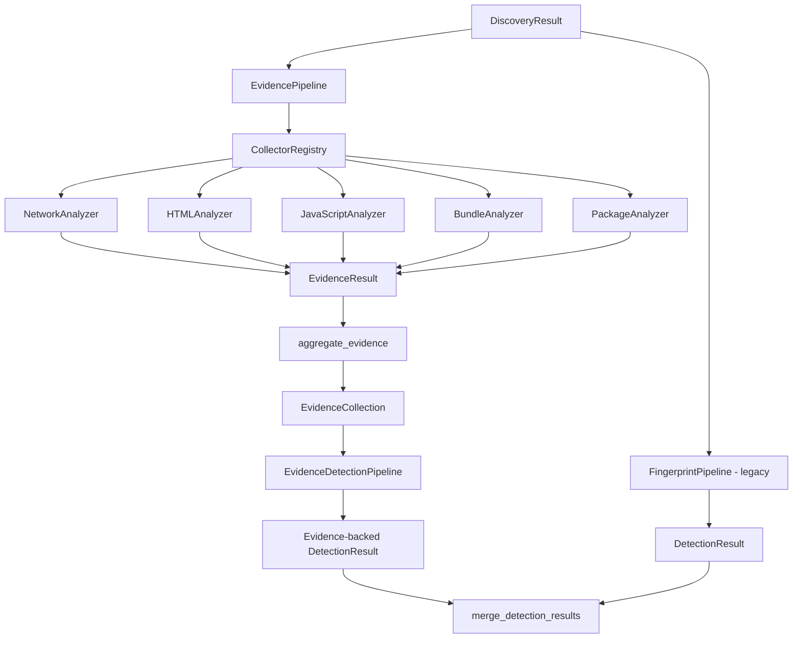

# Next-Generation Fingerprinting Engine — Evidence Architecture

This document describes the evidence-based fingerprinting architecture. Technology
detection is **evidence-driven**: the knowledge catalog provides signatures and
rules, but confirmed detections require matcher-produced evidence in analyzed
assets.

## Registry vs Detection

| Layer | Purpose |
|---|---|
| **Knowledge catalog** | Signatures, patterns, metadata, version rules (`fingerprints/`, `signatures/catalog/`) |
| **Evidence collection** | Passive observation of target assets — collectors never assign technologies |
| **Detection** | Evaluate signatures against evidence; emit matches only when rules match |

The catalog is **not** a whitelist of technologies allowed in output. Registry
membership alone never creates a detection. Quality gates filter on evidence
strength, not whether a technology is registered.

## Goals

- Collect **evidence only** — analyzers never assign technologies in Phase 1
- Keep analyzers **isolated** and **dependency-injected**
- Preserve **backward compatibility** with the existing `FingerprintPipeline` detection flow
- Prepare **extension points** for plugins and future signature evaluation

## Module Layout

```
techspecter/fingerprinting/
├── evidence/           # Immutable evidence models
├── analyzers/          # Evidence-only collectors (Network, HTML, JS, Bundle, Package)
├── collectors/         # Registry + built-in registration
├── pipeline/           # EvidencePipeline + legacy DetectionPipeline
├── signatures/         # Next-gen signature schema (infrastructure only)
├── extensions/         # Plugin extension interfaces
└── compatibility.py  # Bridge legacy detection + evidence collection
```

## Data Flow



## Evidence Model

| Type | Purpose |
|---|---|
| `Evidence` | Single immutable observation |
| `EvidenceCollection` | Aggregated evidence for a target |
| `EvidenceResult` | Output from one collector |
| `EvidenceSummary` | Counts by collector, source, and type |
| `EvidenceSource` | NETWORK, HTML, JAVASCRIPT, BUNDLE, PACKAGE |
| `EvidenceType` | HTTP_HEADER, SCRIPT_CONTENT, BUNDLE_MARKER, etc. |

Evidence items include: `id`, optional `technology`, `source`, `file`, `url`, `matched_value`, `matched_pattern`, `collector`, `confidence_hint`, `metadata`, `timestamp`, and `reason`.

**Phase 1 rule:** `technology` is always `None` — collectors must not detect technologies.

## Analyzer Lifecycle

1. Registry resolves collectors sorted by `priority`
2. Pipeline calls `supports(discovery)` for each collector
3. Supported collectors run `collect(discovery)` → `EvidenceResult`
4. Pipeline aggregates all items into `EvidenceCollection`

### Analyzer Interface

```python
class EvidenceCollector(BaseAnalyzer):
    def name(self) -> str: ...
    def priority(self) -> int: ...
    def supports(self, discovery: DiscoveryResult) -> bool: ...
    def collect(self, discovery: DiscoveryResult) -> EvidenceResult: ...
```

Analyzers are **fully isolated** — no shared mutable state, no cross-analyzer calls.

## Collector Registry

`CollectorRegistry` supports dynamic registration:

```python
from techspecter.fingerprinting.collectors import collector_registry
from techspecter.fingerprinting.analyzers import NetworkAnalyzer

collector_registry.register(NetworkAnalyzer())
```

Built-in collectors register via `collectors/builtin.py` when the pipeline package loads.

## Pipelines

### EvidencePipeline (Phase 1)

```python
from techspecter.fingerprinting.pipeline import EvidencePipeline

collection = EvidencePipeline().collect(discovery)
```

Returns `EvidenceCollection` — no `DetectionResult`, no technology matches.

### FingerprintPipeline (Legacy — unchanged)

```python
from techspecter.fingerprinting.pipeline import FingerprintPipeline

detection = FingerprintPipeline().run(discovery)
```

Existing CLI, `FingerprintService`, and `TechnologyFingerprintAnalyzer` continue using this path.

### Compatibility Layer

```python
from techspecter.fingerprinting import FingerprintCompatibilityLayer

layer = FingerprintCompatibilityLayer()
detection, evidence = layer.analyze(discovery)
```

Runs both pipelines without breaking legacy behavior.

## Signature Infrastructure

`TechnologySignature` in `signatures/models.py` defines the future schema:

- `positive_rules`, `negative_rules`, `required_rules`, `optional_rules`
- `version_extractors` (empty/disabled in Phase 1)
- Existing JSON fingerprints in `techspecter/fingerprints/` are **not migrated yet**

## Extension Points (Phase 1 — interfaces only)

| Interface | Purpose |
|---|---|
| `CollectorPlugin` | Register custom evidence collectors |
| `EvidenceProviderPlugin` | Register standalone evidence providers |
| `FingerprintPluginExtension` | Future combined plugin hook |

No plugin migration is performed in Phase 1.

## Future Phases

| Phase | Focus |
|---|---|
| 2 | Signature evaluation against evidence |
| 3 | Confidence scoring |
| 4 | Version extraction |
| 5 | Explainable detection and migration from legacy engine |

## Related Documentation

- [ARCHITECTURE.md](ARCHITECTURE.md)
- [DEVELOPER.md](DEVELOPER.md)
