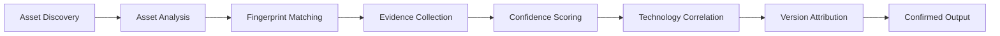

# Technology Detection

TechSpecter identifies technologies from **analyzed assets** — JavaScript bundles, CSS, HTML, manifests, and other discovered files. Detections are never taken from a default list; every confirmed technology must have evidence tied to a real source file.

## How detection works



1. **Asset discovery** — TechSpecter downloads publicly linked scripts, styles, HTML, and related assets.
2. **Fingerprint matching** — Bundled JSON signatures (`techspecter/fingerprints/`) define detection rules. The registry is a rule database only; it never creates output by itself.
3. **Evidence collection** — Each match records the matcher, pattern, matched value, source file, and asset identifier.
4. **Confidence scoring** — Score reflects evidence strength. Strong runtime markers score higher than generic strings or filenames.
5. **Quality gate** — Weak indicators alone are rejected. Confirmed technologies require evidence **and** source attribution.
6. **Version attribution** — When version markers exist in analyzed content, they attach to the technology result. Unknown version is acceptable when runtime evidence is strong.

## Confirmed output format

The `fingerprint` command shows only confirmed technologies:

| Technology | Version | Source | Evidence | Confidence |
|------------|---------|--------|----------|------------|
| React | 19.0.0 | main.js | string:React.createElement | 92.5 |

Technologies without evidence or without a source file never appear in normal output.

## Evidence strength

| Tier | Examples | Confirms alone? |
|------|----------|-----------------|
| **Strong** | `React.createElement`, `reconcilerVersion`, `window.next`, `@mui/material`, `__webpack_require__` | Yes |
| **Medium** | Multiple related indicators from the same asset | Yes (combined) |
| **Weak** | `ng`, `L`, `chunk`, plain `Bootstrap` text, filename-only hits | No |

Weak patterns may support a detection but cannot create confirmed output on their own.

## Supported technologies

TechSpecter ships **65+ bundled fingerprints** covering:

- **Frameworks:** React, Next.js, Vue, Angular, AngularJS, Nuxt, Svelte, and more
- **CSS / UI:** Bootstrap, Tailwind CSS, Material UI, Bulma, Semantic UI
- **Build tools:** webpack, Vite, Turbopack, Rollup, esbuild, Parcel
- **CMS:** WordPress
- **Libraries:** jQuery, Lodash, Axios, D3, Chart.js, and others

Optional providers add Wappalyzer and Retire.js results when their CLI tools are installed.

## Debug mode

Use `--debug-fingerprint` to inspect detection decisions without enabling global debug logging:

```bash
techspecter fingerprint https://example.com --debug-fingerprint
```

Debug output explains:

- Which technologies were confirmed or rejected
- Source file and primary evidence for each decision
- Confidence score and version attribution
- Rejection reason for weak or incomplete matches

Normal users should rely on the **Technology Detection** table; use debug mode when tuning signatures or investigating false positives.

## Related commands

```bash
# Standard technology scan
techspecter fingerprint https://example.com

# Include ignored weak matches
techspecter fingerprint https://example.com --verbose-output

# JSON export for automation
techspecter fingerprint https://example.com --json
```

See also: [VERSION_DETECTION.md](VERSION_DETECTION.md), [SIGNATURE_AUTHORING.md](SIGNATURE_AUTHORING.md), [UNIFIED_PROVIDERS.md](UNIFIED_PROVIDERS.md).
